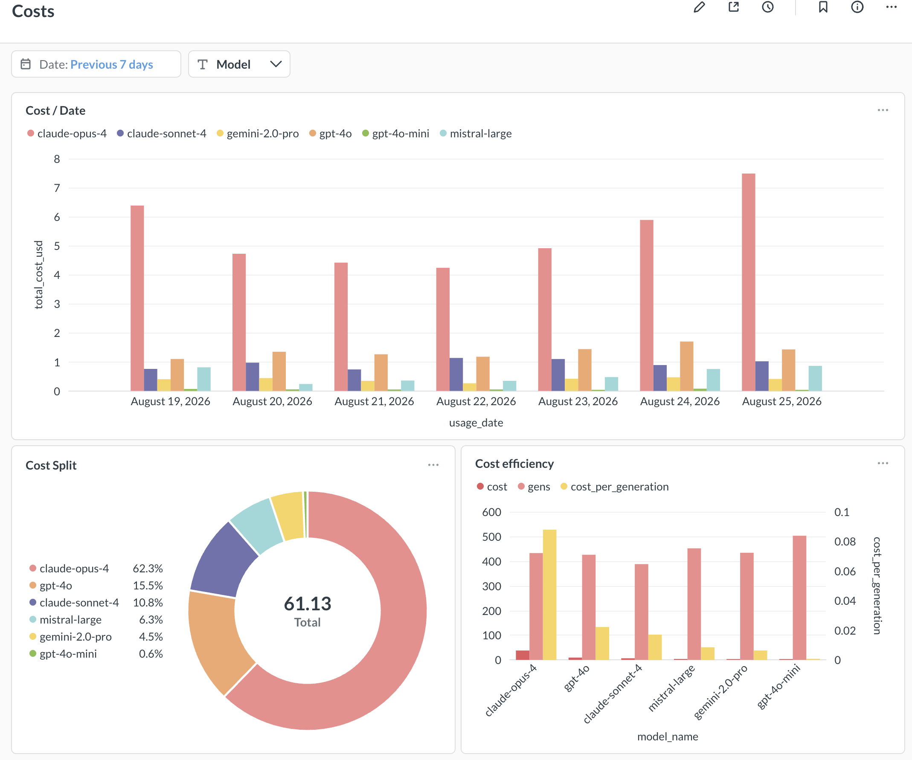
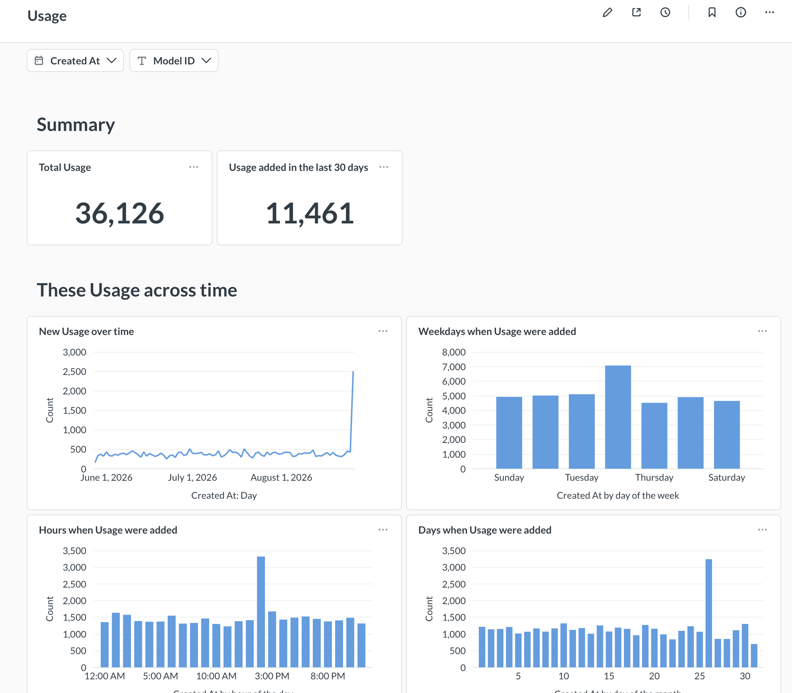
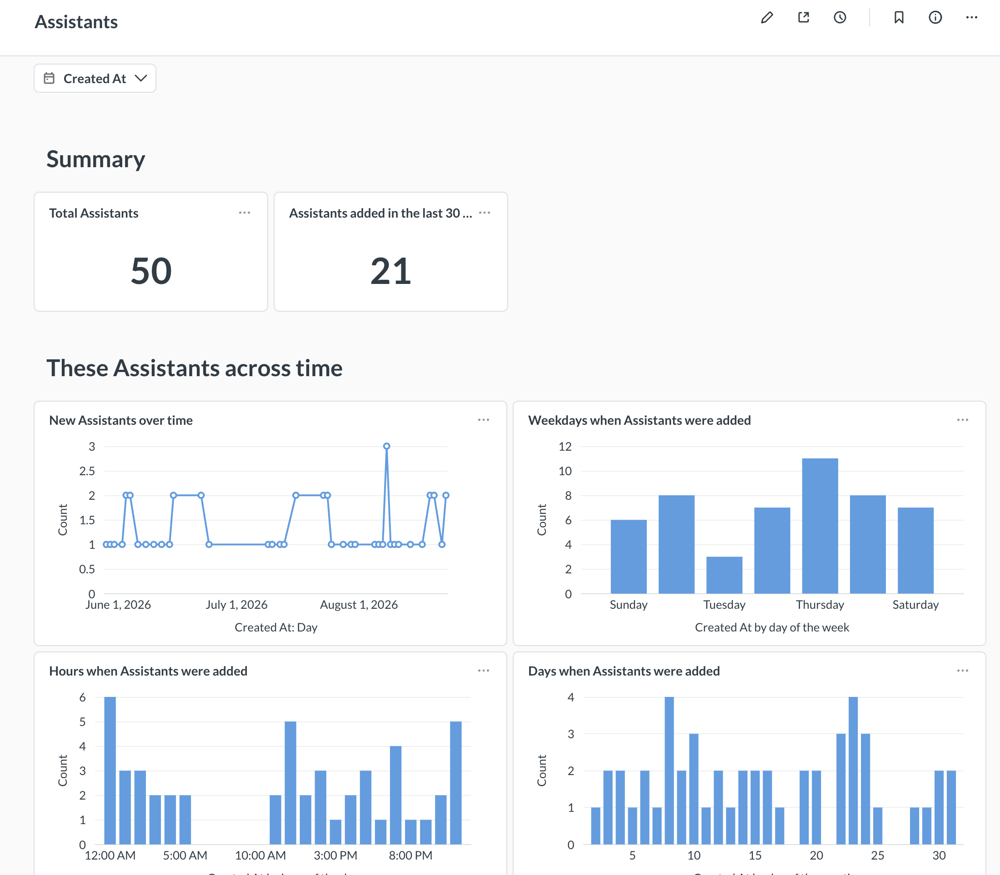
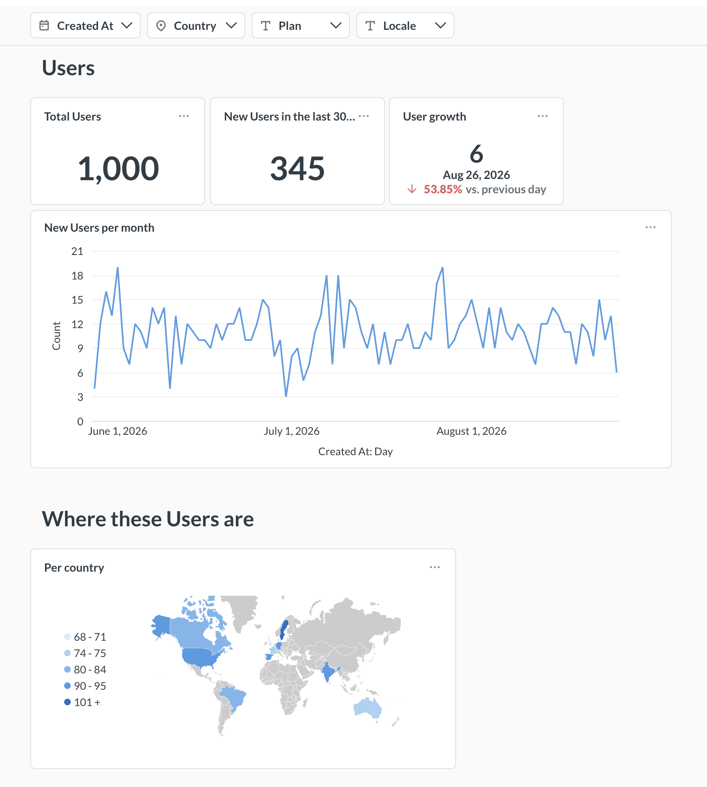

# Design

Continuously ingests a live operational Postgres into an analytical warehouse
via change data capture.
Using DBT to transform the raw data into analytics ready models / marts.
Serving reports via Metabase.

## Architecture at a glance

```
┌─────────────┐   logical      ┌─────────────┐    dbt      ┌──────────────┐   ┌──────────┐
│  Source     │  replication   │  Warehouse  │  (staging   │  Data Models │   │ Metabase │
│  (Postgres) │ ─────────────► │  (Postgres) │ ──────────► │              │──►│dashboards│
│             │   (CDC, WAL)   │             │   + marts)  │ (marts/views)│   │          │
└─────────────┘                └─────────────┘             └──────────────┘   └──────────┘
     ▲                                                          
     │ streamer inserts                                         
     │ live traffic                                             
```

- **Source Postgres** The provided operational database.
- **Ingestion (CDC)** Native Postgres **logical replication** streams every
  insert/update/delete from the source into the warehouse in near realtime.
- **Warehouse** A second Postgres, used as an analytical store. Raw
  replicated tables land in `public`; dbt builds transformed models into
  `analytics`.
- **Transformation** / **Dbt** builds a `staging` layer (cleaning, dedup) and a
  `marts` layer for reporting specific needs.
- **Presentation** / **Metabase** reads the marts and serves dashboards.

For the reasoning behind these choices, see [WRITEUP.md](./WRITEUP.md).

## Requirements

- Docker + Docker Compose
- `make`

Everything runs in Docker containers.

## Quick start

```bash
make up
```

This single command:

1. Starts the source Postgres and the `streamer` which inserts live messages continuously.
2. Starts the warehouse Postgres and runs an idempotent init step that creates the
    publication, warehouse tables + indexes, and the subscription, which ensures continuous replication.
3. Runs dbt to build the staging models and marts.
4. Starts Metabase for dashboards.

Give it a few minutes on first run (dbt's initial build and Metabase's first boot initialization are the slow steps)

### Verify it's working

```bash
make psql-warehouse
```

```sql
-- raw data is replicating and growing:
select count(*) from messages;

-- dbt models are built:
\dt analytics.mart_*
select count(*) from analytics.stg_messages;
```

## Dashboards (Metabase)

Once running, Metabase is at **http://localhost:3000**.

On first launch, complete a short one-time setup:

**1. Create an admin account** — any name / email / password. This is your
Metabase login only; it's unrelated to the database credentials.

**2. Connect the warehouse** — when prompted to add a database, enter:

| Field         | Value       |
|---------------|-------------|
| Database type | PostgreSQL  |
| Display name  | Warehouse   |
| Host          | `warehouse` |
| Port          | `5432`      |
| Database name | `warehouse` |
| Username      | `postgres`  |
| Password      | `secret`    |

> **Note:**
> Metabase stores its own configuration (logins, saved charts) in its app
> database, which is not committed to the repo. On a fresh `make up` the
> connection wizard above is repeated; the underlying data and models are always
> reproduced automatically. Dashboard screenshots are below.

The dbt models live in the **`analytics`** schema and the five `mart_*` tables are
ready to use.

### Some Examples from Metabase






## Data models

Built by dbt into the `analytics` schema.

**Staging** (`stg_*`, one per source table) — light cleaning, casting, and
deduplication. Materialized as views.

**Marts** (`mart_*`) — business metrics, materialized as tables:

| Mart | Question it answers |
|------|---------------------|
| `mart_model_cost_daily`       | Daily $ cost and token usage per model |
| `mart_usage_daily`            | Messages, conversations, active users by day / channel / department / plan |
| `mart_feedback_by_model_daily`| Thumbs-up rate (satisfaction) per model over time |
| `mart_assistant_summary`      | Per-assistant message volume and satisfaction |
| `mart_cost_by_plan_daily`     | Cost-to-serve by plan tier and department |

The project also includes dbt **tests** (`unique`/`not_null` on keys,
`accepted_values` on enums), model/column **descriptions**, and a shared
**`token_cost` macro** centralizing the pricing formula and cached-discount
assumption. Run the tests with `make dbt-test`.

## Common commands

| Command | What it does |
|---------|--------------|
| `make up`              | Build and start the whole stack |
| `make down`            | Stop and remove containers **and volumes** (full reset) |
| `make logs`            | Follow logs from all services |
| `make ps`              | Show service status |
| `make psql`            | psql shell against the **source** database |
| `make psql-warehouse`  | psql shell against the **warehouse** |
| `make dbt-run`         | Re-run dbt models on demand |
| `make dbt-test`        | Run dbt data tests |
| `make reseed`          | Wipe and reload the source dataset in place |

## Project layout

```
.
├── docker-compose.yml # provided: source Postgres, seed, streamer
├── docker-compose.override.yml # added: warehouse, init, dbt, metabase
├── warehouse/
│   ├── schema.sql # warehouse tables + analytical indexes
│   └── init.sh # idempotent CDC setup (publication/subscription)
├── docs/
│   ├── assistants.png
│   ├── costs.png
│   ├── usage.png
│   ├── users.png
├── dbt/
│   ├── Dockerfile
│   ├── dbt_project.yml
│   ├── profiles.yml
│   └── models/
│       ├── staging/ # stg_* models + source declarations
│       └── marts/ # mart_* models
├── Makefile
└── WRITEUP.md
```

## Notes

- **Credentials** are the dev defaults provided by the challenge (`postgres` /
  `secret`), read via environment variables with safe defaults so the stack
  runs with no `.env` file.